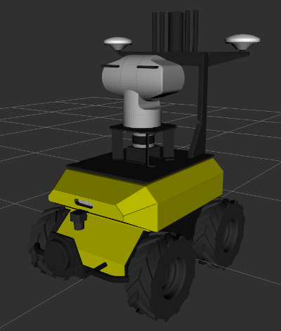
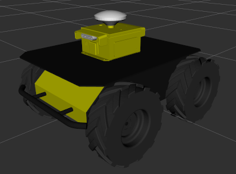
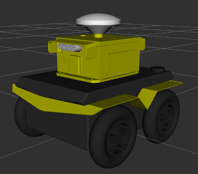
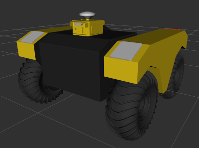

# cpr_onav_description

This package contains additional description files used for Clearpath Robotics' OutdoorNav software.

## Getting Started - Physical Robots

If you have a physical robot that uses OutdoorNav, please follow the OutdoorNav user manual for instructions on
configuring your robot model.

The OutdoorNav setup script will prompt you to configure the type, number, and position of all sensors on the robot,
automatically generating the necessary environment variables and configuring the robot's description as needed.

## Getting Started - Simulations

To simplify simulating robots with the OutdoorNav hardware, several scripts with the necessary environment variables
have been provided to add common configurations to existing platforms:

| Platform            | Model                                       |
|---------------------|---------------------------------------------|
| Husky Observer      |    |
| Husky Starter Kit   |      |
| Jackal Starter Kit  |    |
| Warthog Starter Kit |  |

To simulate these configurations, source the appropriate file in the `scripts` directory, and then start the
simulation, for example:

```bash
source $(catkin_find cpr_onav_description scripts/husky_starter_kit_envars.bash --first-only)
roslaunch husky_gazebo husky_playpen.launch
```

The Husky Observer configuration features a PTZ camera, which contains PID controllers to enable control over the pan
and tilt of the camera.  The [`ptz_action_server`](https://github.com/clearpathrobotics/ptz_action_server) repository
contains the `simulated_ptz_action_server` package which can be used to add an `actionlib` interface to control the
position and zoom level of the simulated camera if desired.
